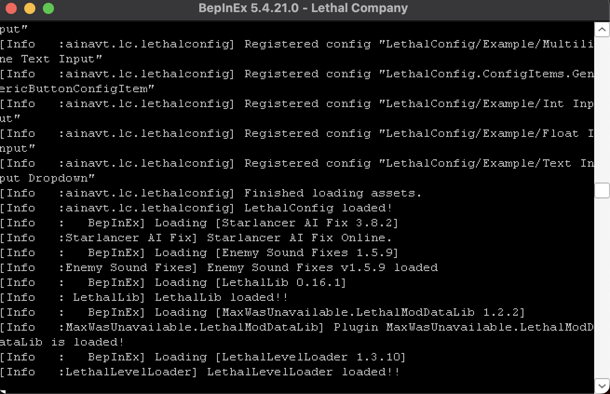
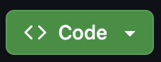
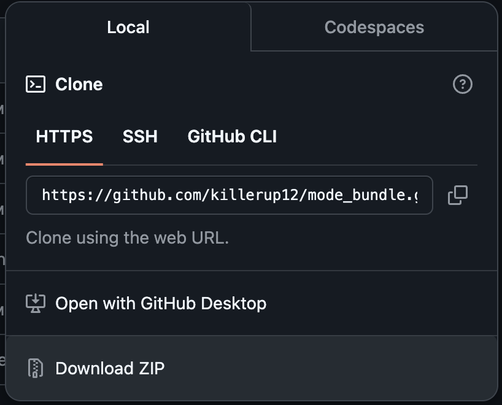

# Версия - 1.0.0

# Предворительная подготовка

Если Вы будете устанавливать моды, то вы не сможете играть с людьми, что не имеют модов. Это надо понимать. Из-за этого будет лушим решением копировать папку с игрой и заменять один на другой, если это необходимо.

# Установка

## Установка базы для всех модов

Для устаноки требуется сначала установить мод [BepInExPack](https://thunderstore.io/c/lethal-company/p/BepInEx/BepInExPack/). После скачивания архива надо перенести сожержимое файла в папке с игрой. Если возникают проблемы с поиском директории с игрой, то откройте `Steam` -> Правой *кнопкой мыши по игре* ->`Свойства...`->`Установленные файлы`->`Обзор`.

После этого надо запустить игру, чтобы сформировались нужные файлы внутри директории. Верным признаком того, что все идет хорошо - появление окна: 
Содержимое будет отличаться. Главное, чтобы оно появилось.

Как результат в дирректории `BepInEx` должны появиться папки `config`, `core`, `patchers` и `plugins`. Если так - значит можем продолжать.

## Установка сборки модов

### Используя Git

#### Для Windows

Открываем CMD и вставляем эту команду. Вместо `${Путь к игре}` требуется вставить путь до игры.

```
set "game_path=${Путь к игре}" && (git clone https://github.com/killerup12/mode_bundle.git C:\Temp\mode_bundle && for /D %d in (config core patchers plugins) do xcopy /E /I C:\Temp\mode_bundle\%d "%game_path%\BepInEx\%d") && rmdir /S /Q C:\Temp\mode_bundle
```

del /Q %game_path/%d && (for /D %i in ("C:\Program Files (x86)\Steam\steamapps\common\Lethal Company\config\*") do rmdir /S /Q "%i") && (for /D %d in (config core patchers plugins) do xcopy /E /I C:\Temp\mode_bundle\%d "C:\Program Files (x86)\Steam\steamapps\common\Lethal Company\BepInEx\%d")

#### Для MacOS

Открываем Terminal и вставляем эту команду. Вместо `${Путь к игре}` требуется вставить путь до игры.

```
export game_path="${Путь к игре}" && git clone https://github.com/killerup12/mode_bundle.git /tmp/mode_bundle && (for dir in config core patchers plugins; do cp -R /tmp/mode_bundle/$dir "$game_path/BepInEx"; done) && rm -rf /tmp/mode_bundle
```

### Без использования Git

Нажмите в правом верхнем углу кнопку


В выпадающем списек выбираем `Download ZIP`

Распаковываем архив и перекивыем папки `config`, `core`, `patchers` и `plugins` в папку `BepInEx`, которая находится в директории игры.

# Правила добавления новых модов в сборку

Ничего сложного. Делаем форк, добавляем моды, что хотим видеть тут. Оцениваем, как играется и отправляем Merge Request. Если мод будет одобрен, то он появится у всех.

В качестве название бранча пишем только название мода с стиле snake (*this_is_example*). В одном бранче можно добавить только один мод (можно добавлять еще моды, только если они являются обязательными для работы побликуемого).

Все добавлые моды (и вспомогательные, и основные) требуется указывать в разделе "Актуальный список модов"!

# Актуальный список модов

Основные моды:

1. [Wesleys Moons](https://thunderstore.io/c/lethal-company/p/Magic_Wesley/Wesleys_Moons/)
2. [Backrooms](https://thunderstore.io/c/lethal-company/p/Backrooms/Backrooms/)
3. [LethalCasino](https://thunderstore.io/c/lethal-company/p/mrgrm7/LethalCasino/)
4. [AlwaysHearActiveWalkies](https://thunderstore.io/c/lethal-company/p/Suskitech/AlwaysHearActiveWalkies/)
5. [ReservedFlashlightSlot](https://thunderstore.io/c/lethal-company/p/FlipMods/ReservedFlashlightSlot/)
6. [ReservedWalkieSlot](https://thunderstore.io/c/lethal-company/p/FlipMods/ReservedWalkieSlot/)
7. [LethalConfig](https://thunderstore.io/c/lethal-company/p/AinaVT/LethalConfig/)
8. [FastSwitchPlayerViewInRadar](https://thunderstore.io/c/lethal-company/p/kRYstall9/FastSwitchPlayerViewInRadar/)
9. [Immersive Visor](https://thunderstore.io/c/lethal-company/p/Woecust/Immersive_Visor/)

Вспомогательные моды:

1. [HookGenPatcher](https://thunderstore.io/c/lethal-company/p/Evaisa/HookGenPatcher/)
2. [LethalLib](https://thunderstore.io/c/lethal-company/p/Evaisa/LethalLib/)
3. [FixPluginTypesSerialization](https://thunderstore.io/c/lethal-company/p/Evaisa/FixPluginTypesSerialization/)
4. [LethalModDataLib](https://thunderstore.io/c/lethal-company/p/MaxWasUnavailable/LethalModDataLib/)
5. [LethalLevelLoader](https://thunderstore.io/c/lethal-company/p/IAmBatby/LethalLevelLoader/)
6. [LethalToolbox](https://thunderstore.io/c/lethal-company/p/IAmBatby/LethalToolbox/)
7. [StarlancerAIFix](https://thunderstore.io/c/lethal-company/p/AudioKnight/StarlancerAIFix/)
8. [LCMaxSoundsFix](https://thunderstore.io/c/lethal-company/p/Hardy/LCMaxSoundsFix/)
9. [CompanyCruiserFix](https://thunderstore.io/c/lethal-company/p/DiFFoZ/CompanyCruiserFix/)
10. [ReservedItemSlotCore](https://thunderstore.io/c/lethal-company/p/FlipMods/ReservedItemSlotCore/)
11. [loaforcsSoundAPI](https://thunderstore.io/c/lethal-company/p/loaforc/loaforcsSoundAPI/)
12. [UniTask](https://thunderstore.io/c/lethal-company/p/Bobbie/UniTask/)

---

# Известные проблемы

## MacOS (Через Whisky или CrossOver)

### Не получается установить мод [BepInExPack](https://thunderstore.io/c/lethal-company/p/BepInEx/BepInExPack/).

Проблема решается достаточно просто. Надо перейти в настройки бутылки и нажать `Открыть конфигурацию Wine`. Там надо перейти в раздел `Библиотеки`. Тут есть подраздел `Новое замещение для библиотеки:`. Надо бырать `winhttp`.

После этого переходим в подпунки ниже - `Существуюшие замещения:`. Там надо выбрать только что добавленный `winhttp` и нажать `Изменить...`. Надо задать порядок загрузки `Сторонняя, затем встроенная`. Перезапускаеи бутылку и пробуем снова запустить игру. Все должно нормализоваться.
